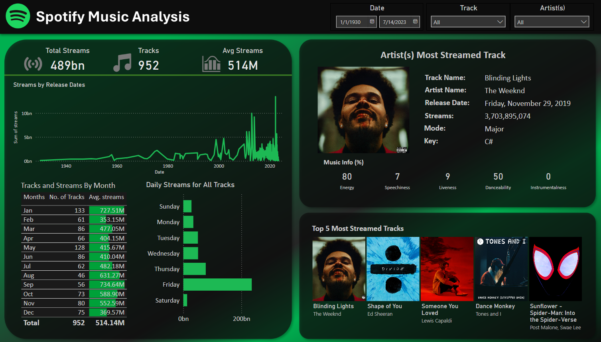

# **Spotify Music Analysis Dashboard**

## Table of Contents
- [Overview](#overview)
- [Features](#features)
- [Skills Used](#skills-used)
- [Preview](#preview)
- [Getting Started](#getting-started)

## Overview
An interactive business intelligence dashboard built in Power BI to analyze Spotify streaming data across 950+ tracks.

## Features 
- Total and average stream KPIs
- Line chart by release year
- Monthly and weekday listening trends
- Top 5 streamed tracks with album images
- Audio feature visualizations (energy, danceability, etc.)
- Dynamic slicers for track, artist, and date

## Skills Used
- Power BI Desktop
- DAX (Data Analysis Expressions)
- Data Modeling & Relationships
- Custom visuals & KPI cards

## Preview

## Getting Started
To view this dashboard:
1. Download the '.pbix' file from this repo
2. Open it using [Power BI Desktop](https://powerbi.microsoft.com/desktop/)
